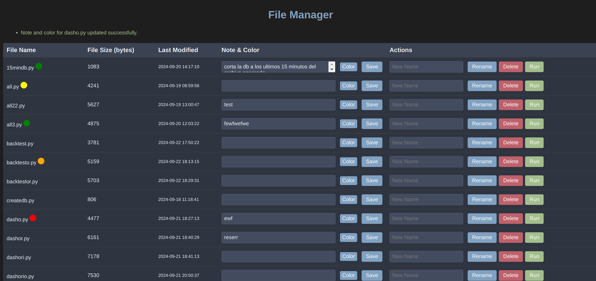

# Filey

Filey is a file system designed as a lifehack
Allows you to add notes, color tags and other actions to your files.
Make sure you change your Path to the files you want to administer
FILES_DIR = '/Change to your location/'  # Change to your folder with Python files
make a temlates folder and have the index file in there, in two spots of the python code.
Put a password at app.secret_key = 'Change to yours'
Install the requirements and you are set!
The shell file is to run files directly on the terminal.

Donations are welcome in Network BEP20 0x32ffa1135a4ff596356df0f327e3ff99247ef2d7
